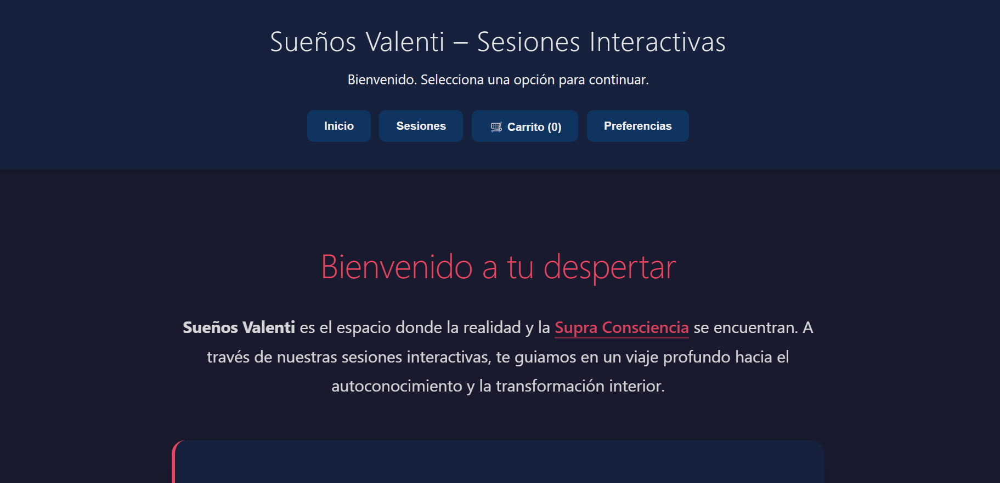

# 🌙 SueñosValentí

Este es mi proyecto personal para perderle el miedo a **JavaScript Vanilla**. Quería ver hasta dónde podía llegar construyendo una SPA (Single Page Application) desde cero, sin frameworks ni librerías, solo código nativo.

El resultado es una web inmersiva para una marca ficticia de servicios de consciencia, donde he puesto a prueba todo lo aprendido sobre gestión del DOM y asincronía.

## 🚀 ¿De qué va esto?

Es un e-commerce simulado para reservar sesiones. La gracia es que, aunque parezca que cambias de página, todo ocurre en el mismo `index.html`. JavaScript se encarga de "pintar" y borrar las vistas al vuelo.

### Lo que he construido:
* **SPA Artesanal:** Navegación fluida entre Inicio, Sesiones y Carrito sin recargas. Todo manipulando el DOM a mano.
* **Datos dinámicos (Fetch):** Nada de HTML estático para los productos. Se cargan desde un `sesiones.json` local simulando una petición a una API real.
* **Carrito funcional:** Puedes añadir sesiones, ver cómo sube el precio total, borrar items y vaciarlo.
* **Modo Día/Noche:** Un interruptor de tema persistente usando variables CSS.
* **Arquitectura Modular:** He intentado no hacer un "código espagueti", separando estilos y lógica en archivos pequeños y ordenados.

## 🛠️ Stack Tecnológico

* **HTML5** (Semántico)
* **CSS3** (Grid, Flexbox y animaciones custom)
* **JavaScript ES6+** (Modules, Async/Await y Event Delegation)

## 📦 ¿Cómo está organizado?

He intentado mantener una estructura limpia para no perderme:

```text
/data          -> sesiones.json (Mi "base de datos")
/img           -> Donde aparece la imagen para añadirla al readme.md
/pages         -> La lógica de cada vista (Home, Sessions, Carrito...)
/functions.js  -> El cerebro: controla el router y la navegación.
style.css      -> El archivo madre que importa el resto de CSS
main.js        -> El punto de entrada
index.html     -> El esqueleto

## 🔧 Cómo probarlo

Al usar módulos de ES6 (`import`/`export`) y `fetch`, necesitas un servidor local para evitar errores de **CORS** (el navegador bloquea la lectura de archivos locales por seguridad).

1.  Clona o descarga el repositorio.
2.  Abre la carpeta en **VS Code**.
3.  Usa la extensión **Live Server** (click derecho en `index.html` -> *Open with Live Server*).
4.  ¡Listo!

## 📝 Notas del desarrollador

Lo más interesante de este proyecto fue adaptar la lógica de negocio (añadir sesiones espirituales) con la lógica técnica (**DOM manipulation**).

**Retos superados:**
* Gestionar la **asincronía** al leer el JSON local.
* Implementar la **delegación de eventos** en el contenedor principal para manejar clicks en botones que aún no existían al cargar la página.
* Separar la lógica de datos (`carrito.js`) de la lógica de renderizado para evitar errores de referencia nula.

## 🔜 Próximos pasos (To-Do)

- [ ] Guardar el estado del carrito en `localStorage` para persistencia.
- [ ] Añadir filtros por tipo de sesión (ej: Meditación vs Regresión).
- [ ] Implementar página de detalle de sesión.

---
Hecho con ganas por **[Alberto Peinado]**.